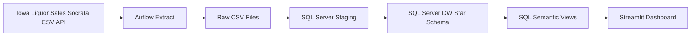

# Hurtownia danych do analizy sprzedazy, produktow, sklepow i regionow na podstawie danych Iowa Liquor Sales

Projekt przedstawia kompletna hurtownie danych dla analizy sprzedazy detalicznej i dystrybucji regulowanych produktow. Dane pochodza z publicznego zbioru Iowa Liquor Sales udostepnianego przez Socrata API. Projekt jest przygotowany pod kurs z architektury hurtowni danych i obejmuje:

- realne dane publiczne,
- pytania biznesowe,
- model wymiarowy i schemat gwiazdy,
- ETL w Apache Airflow,
- SQL Server jako warstwe hurtowni,
- SQL views jako warstwe semantyczna,
- dashboard Streamlit z raportami i wykresami.

## Cel projektu

Projekt wspiera analize sprzedazy na poziomie daty, sklepu, regionu, kategorii, vendora, produktu i opakowania. Narracja projektu dotyczy retail distribution analytics, nie analizy konsumpcji.

## Zrodlo danych

Publiczny zbior danych:

```text
Iowa Liquor Sales
Socrata resource ID: m3tr-qhgy
Endpoint: https://data.iowa.gov/resource/m3tr-qhgy.csv
```

Domyslny zakres ekstrakcji:

```text
2023-01-01 to 2023-12-31
```

Paginacja:

```text
$limit=50000
$offset=0
$offset=50000
$offset=100000
...
```

Pliki raw zapisywane sa lokalnie:

```text
data/raw/iowa_liquor_sales_2023_part_000.csv
data/raw/iowa_liquor_sales_2023_part_001.csv
...
```

## Architektura



## Bronze / Silver / Gold

Chociaz projekt jest zbudowany w klasycznej architekturze hurtowni danych `raw -> staging -> dw -> sem`, mozna go tez opisac jezykiem warstw Bronze / Silver / Gold.

### Bronze

Warstwa Bronze to surowe dane pobrane ze zrodla:

- pliki `CSV` zapisane w `data/raw`
- minimalna ingerencja w dane
- kopia danych z API do dalszego przetwarzania

Przyklady:

- `data/raw/iowa_liquor_sales_2023_part_000.csv`
- `data/raw/iowa_liquor_sales_2023_part_001.csv`

### Silver

Warstwa Silver to dane oczyszczone i ujednolicone technicznie:

- `stg.iowa_liquor_sales_raw`
- nazwy kolumn w `snake_case`
- konwersje typow
- podstawowe czyszczenie tekstu
- standaryzacja identyfikatorow
- parsowanie wspolrzednych

To jeszcze nie jest warstwa raportowa. To warstwa przygotowania danych do modelu wymiarowego.

### Gold

Warstwa Gold to dane gotowe do analizy biznesowej:

- model wymiarowy `dw.*`
- tabela faktow `dw.fact_sales`
- wymiary `dw.dim_*`
- warstwa semantyczna `sem.*`

Najbardziej biznesowa czesc Gold w tym projekcie to:

- `sem.vw_sales_by_month`
- `sem.vw_sales_by_category`
- `sem.vw_sales_by_store`
- `sem.vw_kpi_summary`

To wlasnie z warstwy Gold korzysta dashboard Streamlit.

### Najkrotsza odpowiedz na obronie

```text
Bronze to raw CSV files z API.
Silver to staging w SQL Server po czyszczeniu i standaryzacji.
Gold to model gwiazdy w `dw` oraz widoki semantyczne `sem`, z ktorych korzysta dashboard.
```

## Stack

- Apache Airflow
- SQL Server
- SQL views w schemacie `sem`
- Streamlit
- Docker Compose

## Model wymiarowy

Schemat gwiazdy zawiera:

- `dw.fact_sales`
- `dw.dim_date`
- `dw.dim_store`
- `dw.dim_product`
- `dw.dim_category`
- `dw.dim_vendor`
- `dw.dim_packaging`

Kluczowe zalozenia modelu:

- ziarno faktu: jedna linia sprzedazy produktu w sklepie, w danym dniu i na danej fakturze,
- `sales_line_count` jest miara addytywna,
- `state_bottle_cost` i `state_bottle_retail` sa miarami jednostkowymi, nieaddytywnymi,
- geografia jest utrzymywana w `dim_store`,
- szosty wymiar to `dim_packaging`, a nie zduplikowana geografia.

Szczegoly: [dimensional_model.md](/D:/pjatk-idh/data-warehouse-iowa-liquor/docs/dimensional_model.md)

## Slownik danych

Ta sekcja opisuje dokladnie, co oznacza kazde pole w tabeli faktow i w tabelach wymiarow. To jest praktyczny slownik danych do obrony projektu.

### Prawda biznesowa modelu

Najwazniejsza tabela w hurtowni to:

```text
dw.fact_sales
```

To ona przechowuje **zdarzenie biznesowe**, czyli pojedyncza linie sprzedazy produktu.

Przyjeta prawda biznesowa brzmi:

```text
Jeden rekord w dw.fact_sales reprezentuje jedna linie sprzedazy produktu
w konkretnym sklepie, w konkretnym dniu i na konkretnej fakturze.
```

To oznacza:

- nie jest to poziom miesiaca,
- nie jest to poziom sklepu,
- nie jest to poziom calej faktury,
- tylko poziom jednej pozycji sprzedazowej.

### `dw.fact_sales` - tabela faktow

| Pole | Opis | Przyklad |
|---|---|---|
| `sales_key` | Techniczny klucz glowny rekordu faktu. Nie ma znaczenia biznesowego. | `1054321` |
| `date_key` | Klucz obcy do `dw.dim_date`, identyfikuje date sprzedazy. | `20230103` |
| `store_key` | Klucz obcy do `dw.dim_store`, identyfikuje sklep. | `27` |
| `product_key` | Klucz obcy do `dw.dim_product`, identyfikuje produkt. | `854` |
| `category_key` | Klucz obcy do `dw.dim_category`, identyfikuje kategorie produktu. | `14` |
| `vendor_key` | Klucz obcy do `dw.dim_vendor`, identyfikuje vendora. | `39` |
| `packaging_key` | Klucz obcy do `dw.dim_packaging`, identyfikuje cechy opakowania. | `8` |
| `invoice_number` | Wymiar zdegenerowany. Numer linii faktury lub numer transakcji zrodlowej. | `INV-54555400001` |
| `source_row_hash` | Techniczny hash rekordu zrodlowego, pomocny przy sledzeniu danych i deduplikacji technicznej. | `7a0f...e4c9` |
| `sales_line_count` | Miara addytywna rowna `1` dla kazdej linii sprzedazy. Uzywana do liczenia liczby linii. | `1` |
| `bottles_sold` | Liczba sprzedanych butelek w danej linii. | `12` |
| `sale_dollars` | Wartosc sprzedazy tej linii w dolarach. To glowna miara przychodowa. | `215.88` |
| `volume_sold_liters` | Laczny wolumen sprzedazy tej linii w litrach. | `9.00` |
| `volume_sold_gallons` | Laczny wolumen sprzedazy tej linii w galonach. | `2.38` |
| `state_bottle_cost` | Koszt jednostkowy jednej butelki. Miara nieaddytywna. | `11.49` |
| `state_bottle_retail` | Cena detaliczna jednostkowa jednej butelki. Miara nieaddytywna. | `17.99` |
| `margin_amount` | Marza dla calej linii, liczona jako `(state_bottle_retail - state_bottle_cost) * bottles_sold`. | `78.00` |
| `load_timestamp` | Czas zaladowania rekordu do tabeli faktow. | `2026-05-28 23:14:03` |

### Jak rozumiec miary w `dw.fact_sales`

Miary addytywne, ktore wolno sumowac:

- `sales_line_count`
- `bottles_sold`
- `sale_dollars`
- `volume_sold_liters`
- `volume_sold_gallons`
- `margin_amount`

Miary nieaddytywne, ktorych nie nalezy sumowac:

- `state_bottle_cost`
- `state_bottle_retail`

Te dwa pola sa cenami jednostkowymi. W raportach powinny byc analizowane przez:

- `AVG`
- marze jednostkowa
- porownanie cen

### `dw.dim_date` - wymiar czasu

| Pole | Opis | Przyklad |
|---|---|---|
| `date_key` | Klucz glowny wymiaru czasu w formacie `YYYYMMDD`. | `20230103` |
| `date` | Pelna data kalendarzowa. | `2023-01-03` |
| `day` | Dzien miesiaca. | `3` |
| `month` | Numer miesiaca. | `1` |
| `month_name_en` | Nazwa miesiaca po angielsku. | `January` |
| `month_name_pl` | Nazwa miesiaca po polsku. | `styczen` |
| `quarter` | Numer kwartalu. | `1` |
| `year` | Rok kalendarzowy. | `2023` |
| `day_of_week` | Numer dnia tygodnia w SQL Server. | `3` |
| `day_name_en` | Nazwa dnia tygodnia po angielsku. | `Tuesday` |
| `day_name_pl` | Nazwa dnia tygodnia po polsku. | `wtorek` |
| `is_weekend` | Flaga logiczna: `1` weekend, `0` dzien roboczy. | `0` |
| `year_month` | Skrót roku i miesiaca, wygodny do raportow. | `2023-01` |

### Po co istnieje `is_weekend`

To pole pozwala odpowiadac na pytania typu:

- czy weekendy generuja wyzsza sprzedaz niz dni robocze,
- czy wolumen sprzedazy rozni sie wedlug typu dnia,
- czy struktura sprzedazy zmienia sie miedzy weekday i weekend.

### `dw.dim_store` - wymiar sklepu

| Pole | Opis | Przyklad |
|---|---|---|
| `store_key` | Techniczny klucz glowny sklepu. | `27` |
| `store_number` | Biznesowy numer sklepu ze zrodla. | `2190` |
| `store_name` | Nazwa sklepu. | `Central City Liquor` |
| `store_type` | Typ sklepu, jesli bylby dostepny. W tym projekcie najczesciej `NULL`. | `NULL` |
| `address` | Adres ulicy sklepu. | `1460 2nd Ave` |
| `city` | Miasto sklepu. | `Des Moines` |
| `zip_code` | Kod pocztowy sklepu. | `50314` |
| `county` | County, czyli jednostka regionalna w stanie Iowa. | `Polk` |
| `state_name` | Nazwa stanu. W projekcie stale `Iowa`. | `Iowa` |
| `source_store_location` | Oryginalna wartosc lokalizacji ze zrodla, zwykle tekst z adresem lub geolokalizacja. | `POINT (-93.6197 41.6056)` |
| `latitude` | Szerokosc geograficzna sklepu. | `41.6056` |
| `longitude` | Dlugosc geograficzna sklepu. | `-93.6197` |

### Dlaczego geografia jest w `dim_store`

W tym projekcie sklep i lokalizacja sklepu sa mocno zwiazane. Dlatego:

- miasto,
- county,
- zip code,
- wspolrzedne

pozostaly w jednym wymiarze sklepu, zamiast tworzyc zduplikowany osobny `dim_geography`.

### `dw.dim_product` - wymiar produktu

| Pole | Opis | Przyklad |
|---|---|---|
| `product_key` | Techniczny klucz glowny produktu. | `854` |
| `item_number` | Kod produktu ze zrodla. | `1011200` |
| `item_description` | Opis produktu. | `Blended Whiskey` |

### `dw.dim_category` - wymiar kategorii

| Pole | Opis | Przyklad |
|---|---|---|
| `category_key` | Techniczny klucz glowny kategorii. | `14` |
| `category_number` | Kod kategorii ze zrodla. | `1011100` |
| `category_name` | Nazwa kategorii biznesowej. | `Blended Whiskies` |

### `dw.dim_vendor` - wymiar vendora

| Pole | Opis | Przyklad |
|---|---|---|
| `vendor_key` | Techniczny klucz glowny vendora. | `39` |
| `vendor_number` | Kod vendora ze zrodla. | `260` |
| `vendor_name` | Nazwa vendora lub producenta. | `Diageo Americas` |

### `dw.dim_packaging` - wymiar opakowania

| Pole | Opis | Przyklad |
|---|---|---|
| `packaging_key` | Techniczny klucz glowny opakowania. | `8` |
| `pack` | Liczba butelek w opakowaniu handlowym. | `12` |
| `bottle_volume_ml` | Objetosc jednej butelki w mililitrach. | `750` |
| `volume_group` | Uproszczona grupa pojemnosci utworzona w ETL. | `standard` |

### Jak rozumiec `volume_group`

To pole jest wyliczane w ETL, aby uproscic analizy opakowan:

- `unknown` - brak danych o pojemnosci,
- `small` - mniej niz `500 ml`,
- `standard` - od `500 ml` do mniej niz `1000 ml`,
- `large` - od `1000 ml` do mniej niz `1750 ml`,
- `extra_large` - `1750 ml` i wiecej.

### `stg.iowa_liquor_sales_raw` - tabela staging

To nie jest warstwa raportowa. To warstwa posrednia, gdzie trafiaja dane po ekstrakcji i podstawowym czyszczeniu.

Najwazniejsze pola stagingu:

| Pole | Opis | Przyklad |
|---|---|---|
| `staging_key` | Techniczny klucz rekordu stagingowego. | `1` |
| `source_file` | Nazwa pliku raw, z ktorego pochodzi rekord. | `iowa_liquor_sales_2023_part_000.csv` |
| `load_timestamp` | Czas zaladowania do stagingu. | `2026-05-28 23:07:34` |
| `invoice_and_item_number` | Oryginalny identyfikator linii sprzedazy ze zrodla. | `INV-54555400001` |
| `date` | Data sprzedazy. | `2023-01-03` |
| `store_number` | Numer sklepu ze zrodla. | `2190` |
| `store_name` | Nazwa sklepu ze zrodla po normalizacji tekstu. | `Central City Liquor` |
| `city` | Miasto po normalizacji. | `Des Moines` |
| `county` | County po normalizacji. | `Polk` |
| `category` | Kod kategorii ze zrodla. | `1011100` |
| `vendor_number` | Kod vendora ze zrodla. | `260` |
| `item_number` | Kod produktu ze zrodla. | `1011200` |
| `pack` | Liczba butelek w opakowaniu. | `12` |
| `bottle_volume_ml` | Pojemnosc butelki. | `750` |
| `sale_dollars` | Wartosc sprzedazy w zrodle. | `215.88` |
| `source_row_hash` | Hash techniczny rekordu zrodlowego. | `7a0f...e4c9` |

### Relacje miedzy tabelami

Tabela faktow laczy sie z wymiarami tak:

```text
fact_sales -> dim_date
fact_sales -> dim_store
fact_sales -> dim_product
fact_sales -> dim_category
fact_sales -> dim_vendor
fact_sales -> dim_packaging
```

To oznacza, ze kazda liczba w raporcie moze byc analizowana przez:

- czas,
- sklep,
- produkt,
- kategorie,
- vendora,
- opakowanie.

## Pytania biznesowe

Projekt odpowiada na 12 pytan biznesowych. Zestaw jest celowo ulozony tak, aby kazdy wymiar modelu mial jasne zastosowanie:

1. Jak zmienialy sie calkowita sprzedaz, marza i liczba faktur wedlug miesiaca, kwartalu i roku?
2. Ktore kategorie generowaly najwyzszy przychod i marze?
3. Ktore sklepy generowaly najwyzsza sprzedaz i marze?
4. Ktore miasta i county generowaly najwyzszy przychod i wolumen?
5. Ktorzy vendorzy mieli najwyzszy udzial w sprzedazy i wklad w marze?
6. Ktore produkty sprzedawaly sie najlepiej wedlug liczby butelek i wartosci sprzedazy?
7. Ktore kategorie i produkty mialy najwyzsza marze jednostkowa i calkowita?
8. Jak zmieniala sie struktura sprzedazy kategorii w czasie?
9. Ktore regiony mialy wysoki wolumen, ale nizsza wartosc sprzedazy na litr?
10. Jak zmieniala sie srednia sprzedaz na sklep wedlug miesiaca i county?
11. Jak roznia sie sprzedaz, wolumen i liczba faktur w weekendy oraz dni robocze?
12. Ktore grupy opakowan i pojemnosci butelek generowaly najwyzsza sprzedaz, wolumen i marze?

Pelne mapowanie: [business_requirements.md](/D:/pjatk-idh/data-warehouse-iowa-liquor/docs/business_requirements.md)

## ETL Process

DAG Airflow `iowa_liquor_etl` wykonuje:

1. `extract_iowa_liquor_sales`
2. `create_sql_objects`
3. `load_staging`
4. `load_dimensions`
5. `load_fact_sales`
6. `create_semantic_views`
7. `run_quality_checks`

Projekt uzywa prostego full refresh. To celowy wybor dla projektu studenckiego: latwiej pokazac i obronic ETL na prezentacji.

Szczegoly ETL: [etl_description.md](/D:/pjatk-idh/data-warehouse-iowa-liquor/docs/etl_description.md)

## Semantic Layer

Warstwa semantyczna to SQL views w schemacie `sem`:

- `sem.vw_sales_overview`
- `sem.vw_sales_by_month`
- `sem.vw_sales_by_day_type`
- `sem.vw_sales_by_category`
- `sem.vw_sales_by_store`
- `sem.vw_sales_by_vendor`
- `sem.vw_sales_by_packaging`
- `sem.vw_sales_by_geography`
- `sem.vw_sales_map_points`
- `sem.vw_top_products`
- `sem.vw_margin_analysis`
- `sem.vw_volume_vs_revenue`
- `sem.vw_category_sales_over_time`
- `sem.vw_avg_sales_per_store_by_month_region`
- `sem.vw_kpi_summary`
- `sem.vw_etl_status`

Dashboard czyta tylko z tych widokow.

## Reports

Dashboard Streamlit ma 4 strony:

- `Executive overview`
- `Product and category analysis`
- `Geography analysis`
- `Store performance`

Mapowanie pytan do raportow:

| Pytanie | Strona dashboardu | Widoki SQL |
|---:|---|---|
| 1 | Executive overview | `sem.vw_sales_by_month`, `sem.vw_sales_overview` |
| 2 | Product and category analysis | `sem.vw_sales_by_category` |
| 3 | Store performance | `sem.vw_sales_by_store` |
| 4 | Geography analysis | `sem.vw_sales_by_geography`, `sem.vw_sales_map_points` |
| 5 | Product and category analysis | `sem.vw_sales_by_vendor` |
| 6 | Product and category analysis | `sem.vw_top_products` |
| 7 | Product and category analysis | `sem.vw_margin_analysis`, `sem.vw_sales_by_category` |
| 8 | Product and category analysis | `sem.vw_category_sales_over_time` |
| 9 | Geography analysis, Store performance | `sem.vw_volume_vs_revenue` |
| 10 | Store performance | `sem.vw_avg_sales_per_store_by_month_region` |
| 11 | Executive overview | `sem.vw_sales_by_day_type` |
| 12 | Product and category analysis | `sem.vw_sales_by_packaging` |

## How To Run

### 1. Start stack

```powershell
docker compose up -d sqlserver airflow streamlit
```

### 2. Check services live

This project uses Docker containers, not Kubernetes pods.

To see live containers:

```powershell
docker compose ps
```

Expected services:

```text
sqlserver
airflow
streamlit
```

To inspect logs:

```powershell
docker logs iowa-liquor-airflow --tail 100
docker logs iowa-liquor-streamlit --tail 100
docker logs iowa-liquor-sqlserver --tail 100
```

### 3. Open Airflow

```text
http://localhost:8080
```

Login:

```text
username: admin
password: admin
```

### 4. Run ETL in Airflow UI

In Airflow:

1. Open DAG list.
2. Find `iowa_liquor_etl`.
3. Unpause if needed.
4. Trigger DAG manually.
5. Open task logs for:
   - `extract_iowa_liquor_sales`
   - `load_staging`
   - `load_fact_sales`
   - `run_quality_checks`

### 5. Run ETL from terminal

Quick demo run for one day:

```powershell
docker compose run --rm -e IOWA_START_DATE=2023-01-03 -e IOWA_END_DATE=2023-01-03 -e SOCRATA_LIMIT=5000 airflow python -m src.run_initial_etl
```

Python local run:

```powershell
python -m src.run_initial_etl
```

### 6. Open dashboard

```text
http://localhost:8501
```

## How To Verify Project Works

### Raw files

```powershell
Get-ChildItem data\\raw
```

### Airflow DAG exists

```powershell
docker exec iowa-liquor-airflow airflow dags list
```

### SQL Server schemas and tables

Use SQL Server client or Airflow container shell.

Example:

```powershell
docker exec -it iowa-liquor-airflow bash
```

Then run Python or SQL checks.

### Semantic views

Check that views return rows:

```text
sem.vw_sales_overview
sem.vw_sales_by_month
sem.vw_sales_by_category
sem.vw_sales_by_store
sem.vw_sales_by_vendor
sem.vw_sales_by_geography
sem.vw_top_products
sem.vw_margin_analysis
sem.vw_volume_vs_revenue
sem.vw_kpi_summary
```

### Streamlit live

HTTP check:

```powershell
Invoke-WebRequest http://localhost:8501 -UseBasicParsing
```

## Current Verified Demo State

Verified run for `2023-01-03`:

```text
staging rows: 10634
fact rows: 10624
null foreign keys: 0
negative fact measures: 0
semantic views: 16 views returning data
streamlit app: 0 exceptions in smoke test
```

## Documentation

- [project_description.md](/D:/pjatk-idh/data-warehouse-iowa-liquor/docs/project_description.md)
- [business_requirements.md](/D:/pjatk-idh/data-warehouse-iowa-liquor/docs/business_requirements.md)
- [dimensional_model.md](/D:/pjatk-idh/data-warehouse-iowa-liquor/docs/dimensional_model.md)
- [model_wielowymiarowy_etap2.md](/D:/pjatk-idh/data-warehouse-iowa-liquor/docs/model_wielowymiarowy_etap2.md)
- [uzasadnienie_modelu.md](/D:/pjatk-idh/data-warehouse-iowa-liquor/docs/uzasadnienie_modelu.md)
- [warstwa_semantyczna.md](/D:/pjatk-idh/data-warehouse-iowa-liquor/docs/warstwa_semantyczna.md)
- [etl_description.md](/D:/pjatk-idh/data-warehouse-iowa-liquor/docs/etl_description.md)
- [pipeline_flow.md](/D:/pjatk-idh/data-warehouse-iowa-liquor/docs/pipeline_flow.md)
- [presentation_notes.md](/D:/pjatk-idh/data-warehouse-iowa-liquor/docs/presentation_notes.md)
- [progress.md](/D:/pjatk-idh/data-warehouse-iowa-liquor/docs/progress.md)

## Limitations

- Default verified run used one-day slice for fast demo.
- Full-year extract is possible but heavier on laptop resources.
- Project uses full refresh, not incremental loading.
- Container orchestration is Docker Compose, not Kubernetes.
