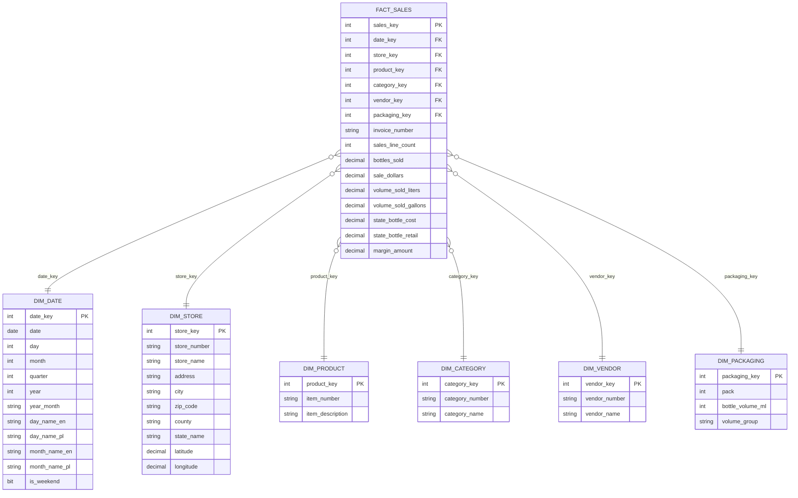

## Cel

Hurtownia danych wspierajaca analize sprzedazy detalicznej i dystrybucji regulowanych produktow na podstawie publicznego zbioru Iowa Liquor Sales. Organizacja chce analizowac sprzedaz wedlug czasu, sklepow, geografii, kategorii, vendorow, produktow i opakowan.

## Pytania biznesowe

Projekt odpowiada na 10 pytan biznesowych, miedzy innymi:

1. Jak zmieniala sie wartosc sprzedazy w miesiacach i kwartalach?
2. Ktore kategorie generowaly najwyzszy przychod?
3. Ktore sklepy osiagnely najwyzsza sprzedaz wartosciowa?
4. Ktore miasta i hrabstwa generowaly najwiekszy obrot?
5. Ktorzy vendorzy mieli najwiekszy udzial w sprzedazy?
6. Ktore produkty sprzedawaly sie najlepiej ilosciowo?
7. Ktore produkty lub kategorie generowaly najwyzsza marze?
8. Jak zmieniala sie struktura sprzedazy wedlug kategorii w czasie?
9. Ktore regiony mialy wysoki wolumen i nizsza wartosc sprzedazy?
10. Jaka byla srednia wartosc sprzedazy na sklep w podziale na miesiace i regiony?


## Diagram schematu gwiazdy



### Ziarno tabeli faktow

Przyjete ziarno:

```text
Jeden rekord w dw.fact_sales reprezentuje jedna linie sprzedazy produktu
w konkretnym sklepie, w konkretnym dniu i na konkretnej fakturze,
zgodnie z ziarnistoscia danych zrodlowych Iowa Liquor Sales.
```