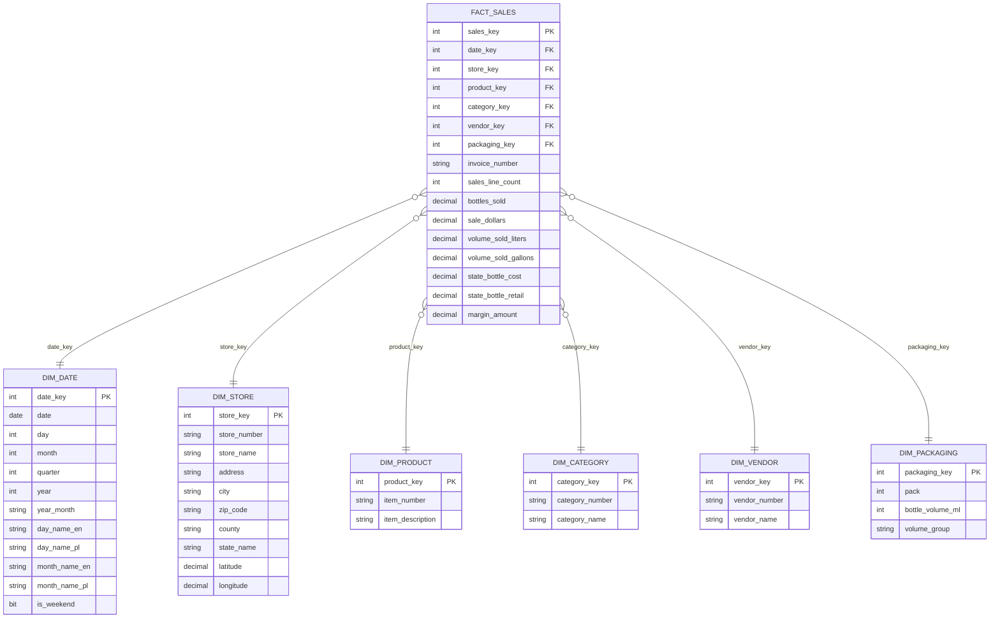

# Model wymiarowy

## Ziarno tabeli faktow

Jeden rekord w `dw.fact_sales` reprezentuje jedna linie sprzedazy produktu w konkretnym sklepie, w konkretnym dniu i na konkretnej fakturze, zgodnie z ziarnistoscia danych zrodlowych Iowa Liquor Sales.

Jezeli w zrodle istnieja duplikaty dla tego samego numeru faktury, produktu, sklepu i daty, rekordy sa zachowywane w stagingu. Agregacja odbywa sie w widokach semantycznych, a nie przez ukryte usuwanie rekordow.

## Tabela faktow

`dw.fact_sales`

Klucze obce:

- `date_key`
- `store_key`
- `product_key`
- `category_key`
- `vendor_key`
- `packaging_key`

Wymiar zdegenerowany:

- `invoice_number`

Miary addytywne:

- `sales_line_count`
- `bottles_sold`
- `sale_dollars`
- `volume_sold_liters`
- `volume_sold_gallons`
- `margin_amount`

Miary jednostkowe / nieaddytywne:

- `state_bottle_cost`
- `state_bottle_retail`

`state_bottle_cost` i `state_bottle_retail` sa cenami jednostkowymi. Nie powinny byc sumowane w raportach. Nalezy analizowac je przez `AVG` albo srednia wazona.

## Wymiary

- `dw.dim_date`: dzien, miesiac, kwartal, rok, etykiety polskie i angielskie.
- `dw.dim_store`: sklep, adres, miasto, kod pocztowy, hrabstwo, stan, wspolrzedne.
- `dw.dim_product`: produkt i opis produktu.
- `dw.dim_category`: kategoria produktu.
- `dw.dim_vendor`: vendor / dostawca.
- `dw.dim_packaging`: pack, pojemnosc butelki i grupa pojemnosci.

## Hierarchie

Data:

```text
day -> month -> quarter -> year
```

Geografia:

```text
store -> city -> county -> state
```

Produkt:

```text
product -> category
```

Vendor analysis:

```text
product -> vendor
```

Packaging analysis:

```text
product -> packaging
```

## Diagram schematu gwiazdy


