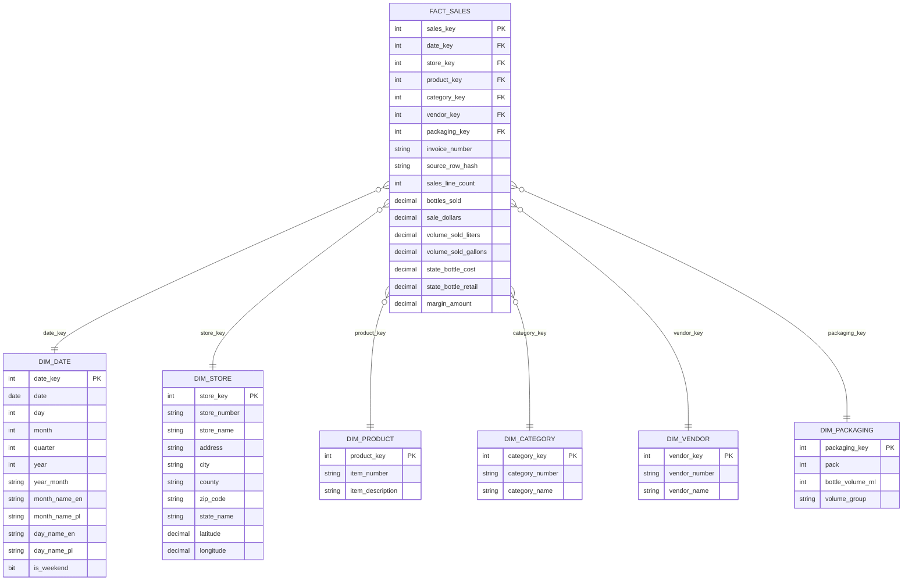

# Model wielowymiarowy i wymagania projektowe

## Temat projektu

**Hurtownia danych do analizy sprzedazy, produktow, sklepow i regionow na podstawie danych Iowa Liquor Sales**

## Charakter projektu

Projekt dotyczy hurtowni **jednotematycznej**. Obszarem analizy jest sprzedaz detaliczna i dystrybucja regulowanych produktow w przekroju czasu, sklepu, produktu, kategorii, vendora, regionu i opakowania.

Z tego powodu dla projektu przyjeto **czysty schemat gwiazdy**. Nie budujemy hurtowni wielotematycznej ani konstelacji faktow. Takie podejscie jest najbezpieczniejsze, najbardziej czytelne i najlepiej odpowiada wymaganiom projektu studenckiego.

## Opis wymagan projektowych

Wymagania zostaly sformulowane tak, aby dalo sie na ich podstawie zweryfikowac poprawnosc modelu danych.

### 1. Dane zrodlowe

Projekt musi korzystac z danych rzeczywistych znalezionych online.

Wymaganie:

- zrodlem danych jest publiczny zbior `Iowa Liquor Sales`,
- dane sa pobierane z API CSV Socrata,
- dane zawieraja wymiar czasu i dane historyczne,
- dane obejmuja informacje o sprzedazy, sklepie, produkcie, kategorii, vendorze i lokalizacji.

Sposob weryfikacji:

- istnieje opis zrodla,
- istnieje skrypt ekstrakcji,
- ETL pobiera dane z `https://data.iowa.gov/resource/m3tr-qhgy.csv`.

### 2. Pytania biznesowe

Projekt musi zawierac zestaw pytan biznesowych, na ktore odpowiada model i raporty.

Wymaganie:

- projekt zawiera 10 pytan biznesowych,
- pytania dotycza sprzedazy w czasie, sklepow, produktow, kategorii, vendorow, geografii, marzy i wolumenu,
- kazde pytanie jest mapowane do raportu lub widoku semantycznego.

Sposob weryfikacji:

- istnieje lista pytan biznesowych,
- istnieje mapowanie pytan do raportow i widokow `sem.*`.

### 3. Model wielowymiarowy

Projekt musi zawierac model wielowymiarowy pozwalajacy odpowiedziec na pytania biznesowe.

Wymaganie:

- model zawiera jedna tabele faktow,
- model zawiera co najmniej szesc wymiarow,
- model ma jasno opisane ziarno,
- model zawiera miary liczbowe i atrybuty opisowe,
- model zawiera hierarchie analityczne.

Sposob weryfikacji:

- istnieje opis faktu, wymiarow, miar i hierarchii,
- istnieje diagram schematu gwiazdy.

### 4. ETL

Projekt musi zawierac proces ETL mozliwy do uruchomienia na zywo.

Wymaganie:

- dane sa pobierane z API,
- dane sa zapisywane jako pliki raw,
- dane sa ladowane do stagingu,
- nastepnie ladowane sa wymiary i fakt,
- proces jest orkiestracyjny w Apache Airflow.

Sposob weryfikacji:

- istnieje DAG `iowa_liquor_etl`,
- istnieja logi ekstrakcji, ladowania i kontroli jakosci.

### 5. Warstwa semantyczna

Projekt musi zawierac warstwe semantyczna wspierajaca raportowanie.

Wymaganie:

- istnieja widoki `sem.*`,
- widoki zawieraja gotowe agregacje, miary i KPI,
- raporty nie korzystaja bezposrednio z tabel `stg` ani `dw`.

Sposob weryfikacji:

- dashboard czyta dane z widokow `sem.*`,
- istnieje opis warstwy semantycznej.

### 6. Raporty

Projekt musi zawierac raporty wynikajace z pytan biznesowych.

Wymaganie:

- raporty zawieraja wykresy,
- raporty zawieraja tabele i agregacje,
- raporty oferuja filtrowanie i parametry,
- raporty pokazuja rozne perspektywy analizy.

Sposob weryfikacji:

- dashboard Streamlit zawiera strony raportowe,
- na kazdej stronie sa wykresy i zestawienia tabelaryczne.

## Wybrany typ modelu

W projekcie przyjeto:

```text
schemat gwiazdy
```

Powod wyboru:

- jeden glowny temat hurtowni: sprzedaz,
- jedna centralna tabela faktow,
- wymiary promieniscie otaczajace fakt,
- brak potrzeby modelowania wielu niezaleznych procesow biznesowych,
- prostota raportowania i prezentacji.

Projekt nie wymaga stosowania `bus matrix` Ralpha Kimballa, poniewaz nie jest hurtownia wielotematyczna.

## Zdarzenie biznesowe

Zdarzeniem biznesowym analizowanym w projekcie jest:

```text
sprzedaz jednej pozycji produktu
```

Na tej podstawie zbudowano centralna tabele faktow.

## Tabela faktow

Centralna tabela modelu:

```text
dw.fact_sales
```

### Ziarno tabeli faktow

Przyjete ziarno:

```text
Jeden rekord w dw.fact_sales reprezentuje jedna linie sprzedazy produktu
w konkretnym sklepie, w konkretnym dniu i na konkretnej fakturze,
zgodnie z ziarnistoscia danych zrodlowych Iowa Liquor Sales.
```

### Klucze obce w tabeli faktow

- `date_key`
- `store_key`
- `product_key`
- `category_key`
- `vendor_key`
- `packaging_key`

### Wymiar zdegenerowany

- `invoice_number`

### Miary addytywne

- `sales_line_count`
- `bottles_sold`
- `sale_dollars`
- `volume_sold_liters`
- `volume_sold_gallons`
- `margin_amount`

### Miary nieaddytywne

- `state_bottle_cost`
- `state_bottle_retail`

Sa to ceny jednostkowe, dlatego powinny byc analizowane przez `AVG`, a nie przez `SUM`.

## Tabele wymiarow

Model zawiera nastepujace wymiary:

### 1. `dw.dim_date`

Opisuje czas transakcji.

Atrybuty:

- `date_key`
- `date`
- `day`
- `month`
- `month_name_en`
- `month_name_pl`
- `quarter`
- `year`
- `day_of_week`
- `day_name_en`
- `day_name_pl`
- `is_weekend`
- `year_month`

### 2. `dw.dim_store`

Opisuje punkt sprzedazy i jego lokalizacje.

Atrybuty:

- `store_key`
- `store_number`
- `store_name`
- `address`
- `city`
- `county`
- `zip_code`
- `state_name`
- `latitude`
- `longitude`

### 3. `dw.dim_product`

Opisuje konkretny produkt.

Atrybuty:

- `product_key`
- `item_number`
- `item_description`

### 4. `dw.dim_category`

Opisuje grupe produktowa.

Atrybuty:

- `category_key`
- `category_number`
- `category_name`

### 5. `dw.dim_vendor`

Opisuje dostawce lub producenta.

Atrybuty:

- `vendor_key`
- `vendor_number`
- `vendor_name`

### 6. `dw.dim_packaging`

Opisuje cechy opakowania.

Atrybuty:

- `packaging_key`
- `pack`
- `bottle_volume_ml`
- `volume_group`

## Hierarchie

### Hierarchia czasu

```text
dzien -> miesiac -> kwartal -> rok
```

### Hierarchia geograficzna

```text
sklep -> miasto -> county -> stan
```

### Hierarchia produktowa

```text
produkt -> kategoria
```

### Perspektywa dostawcy

```text
produkt -> vendor
```

### Hierarchia opakowania

```text
produkt -> bottle_volume_ml -> volume_group
```

## Diagram schematu gwiazdy



## Jak model realizuje wymagania projektowe

Model realizuje wymagania, poniewaz:

1. pozwala analizowac sprzedaz w czasie przez `dim_date`,
2. pozwala analizowac sklepy i regiony przez `dim_store`,
3. pozwala analizowac konkretne produkty przez `dim_product`,
4. pozwala agregowac wyniki po kategoriach przez `dim_category`,
5. pozwala analizowac dostawcow przez `dim_vendor`,
6. pozwala analizowac opakowania i wolumen przez `dim_packaging`,
7. przechowuje miary potrzebne do raportowania sprzedazy, wolumenu i marzy.

## Kryteria poprawnosci modelu

Model nalezy uznac za poprawny, jezeli:

- ma jedna centralna tabele faktow,
- ma co najmniej szesc wymiarow,
- ma jasno zdefiniowane ziarno,
- pozwala odpowiedziec na wszystkie pytania biznesowe,
- zawiera miary i atrybuty zgodne z raportami,
- zachowuje prosty i czytelny uklad gwiazdy.

## Podsumowanie

Projekt wykorzystuje **czysty schemat gwiazdy dla hurtowni jednotematycznej**. Jest to rozwiazanie poprawne, czytelne i adekwatne do zakresu analizy. Wymagania projektowe zostaly sformulowane w sposob mierzalny, a model danych zostal zbudowany tak, aby mozna bylo jednoznacznie sprawdzic, czy je spelnia.
