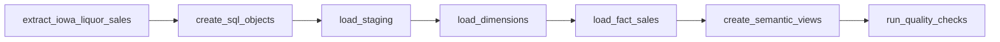
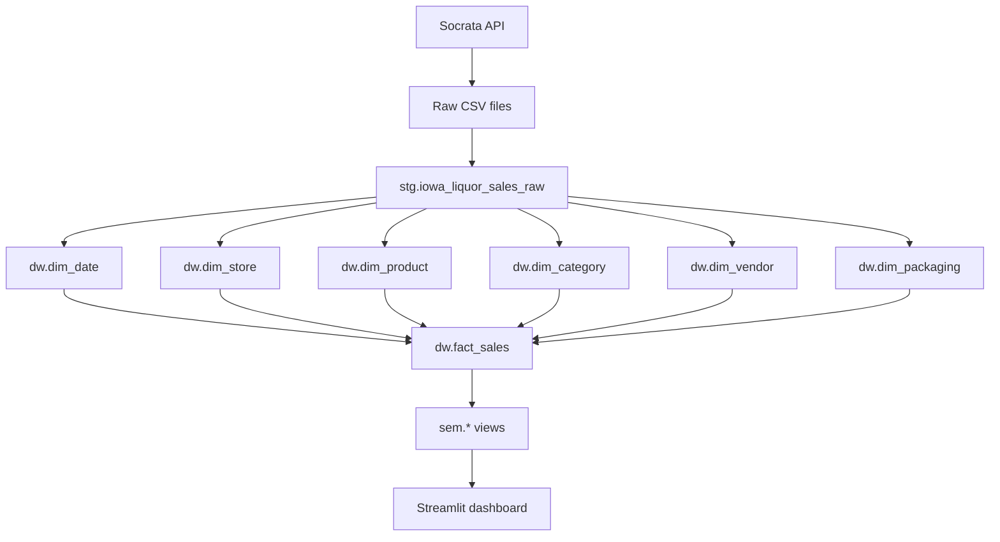

# Pipeline flow i triggery

## Cel

Ten dokument pokazuje dokladny przeplyw procesu ETL oraz sposob uruchamiania pipeline w projekcie.

Ma on sluzyc do prezentacji na zajeciach i do obrony architektury procesu.

## Glowny pipeline

Projekt wykorzystuje jeden glowny pipeline orkiestracyjny:

```text
iowa_liquor_etl
```

Jest to DAG w Apache Airflow.

## Co uruchamia pipeline

W projekcie pipeline jest uruchamiany recznie.

Trigger podstawowy:

- reczne uruchomienie w Airflow UI

Mozliwe tez:

- uruchomienie z CLI Airflow
- uruchomienie lokalnego skryptu Python `src.run_initial_etl`

## Dlaczego trigger reczny

Dla projektu studenckiego trigger reczny jest najlepszy, poniewaz:

- pozwala pokazac ETL na zywo,
- nie wymaga harmonogramu produkcyjnego,
- daje pelna kontrole nad zakresem dat,
- ulatwia prezentacje poszczegolnych krokow.

## Kolejnosc krokow w pipeline

Pipeline dziala w nastepujacej kolejnosci:

1. `extract_iowa_liquor_sales`
2. `create_sql_objects`
3. `load_staging`
4. `load_dimensions`
5. `load_fact_sales`
6. `create_semantic_views`
7. `run_quality_checks`

## Znaczenie poszczegolnych taskow

### 1. `extract_iowa_liquor_sales`

Rola:

- pobranie danych z API Socrata,
- pobranie stron przy uzyciu `limit` i `offset`,
- zapis plikow raw do `data/raw`,
- zapis manifestu ekstrakcji do `data/processed/extract_manifest.json`.

Trigger:

- start calego pipeline

Wejscie:

- `IOWA_START_DATE`
- `IOWA_END_DATE`
- `SOCRATA_LIMIT`

Wyjscie:

- lista plikow CSV

### 2. `create_sql_objects`

Rola:

- utworzenie bazy,
- utworzenie schematow,
- utworzenie tabel staging i DW.

Trigger:

- wykonuje sie po ekstrakcji

Wejscie:

- skrypty SQL z katalogu `sql/`

Wyjscie:

- gotowa struktura SQL Server

### 3. `load_staging`

Rola:

- wyczyszczenie stagingu,
- odczyt plikow raw,
- normalizacja kolumn,
- konwersje typow,
- ladowanie do `stg.iowa_liquor_sales_raw`.

Trigger:

- wykonuje sie po przygotowaniu obiektow SQL

Wejscie:

- pliki raw z ekstrakcji

Wyjscie:

- zaladowana tabela staging

### 4. `load_dimensions`

Rola:

- odswiezenie `dim_date`,
- odswiezenie `dim_store`,
- odswiezenie `dim_product`,
- odswiezenie `dim_category`,
- odswiezenie `dim_vendor`,
- odswiezenie `dim_packaging`.

Trigger:

- wykonuje sie po stagingu

Wejscie:

- dane ze `stg.iowa_liquor_sales_raw`

Wyjscie:

- zaladowane wymiary

### 5. `load_fact_sales`

Rola:

- dolaczenie surrogate keys,
- zaladowanie `dw.fact_sales`,
- wyliczenie `margin_amount`,
- ustawienie `sales_line_count = 1`.

Trigger:

- wykonuje sie po wymiarach

Wejscie:

- staging + wymiary

Wyjscie:

- zaladowana tabela faktow

### 6. `create_semantic_views`

Rola:

- utworzenie i odswiezenie widokow `sem.*`,
- przygotowanie gotowych struktur dla dashboardu.

Trigger:

- wykonuje sie po zaladowaniu faktu

Wejscie:

- tabele `dw.*`

Wyjscie:

- widoki semantyczne

### 7. `run_quality_checks`

Rola:

- uruchomienie kontroli jakosci danych,
- logowanie wynikow,
- przerwanie pipeline w razie bledu.

Trigger:

- wykonuje sie na koncu

Wejscie:

- staging, wymiary, fakt

Wyjscie:

- wynik walidacji procesu

## Diagram pipeline



## Diagram przeplywu danych



## Pipeline jako Bronze / Silver / Gold

Ten sam przeplyw mozna opisac warstwowo:

```text
Bronze  -> data/raw
Silver  -> stg.iowa_liquor_sales_raw
Gold    -> dw.fact_sales + dw.dim_* + sem.*
```

Czyli:

- ekstrakcja buduje Bronze,
- ladowanie stagingu buduje Silver,
- ladowanie wymiarow, faktu i widokow semantycznych buduje Gold.

## Triggery i miejsca uruchamiania

### 1. Airflow UI

To jest glowny sposob pokazywania pipeline.

Kroki:

1. Otworz `http://localhost:8080`
2. Zaloguj sie `admin / admin`
3. Wybierz DAG `iowa_liquor_etl`
4. Kliknij `Trigger DAG`
5. Otworz Graph view
6. Pokaz logi taskow

### 2. CLI Airflow

Przyklad:

```powershell
docker compose exec airflow airflow dags trigger iowa_liquor_etl
```

### 3. Lokalny skrypt Python

Przyklad:

```powershell
python -m src.run_initial_etl
```

To nie jest glowny sposob prezentacji, ale jest dobry do szybkich testow.

## Co pokazac na zywo

Najlepsza kolejnosc prezentacji:

1. Pokaz DAG w Airflow.
2. Pokaz, ze taski sa ulozone liniowo i logicznie.
3. Uruchom `Trigger DAG`.
4. Otworz log `extract_iowa_liquor_sales`.
5. Pokaz:
   - zakres dat,
   - numer strony,
   - offset,
   - liczbe rekordow na stronie,
   - cumulative rows.
6. Otworz `load_staging` i pokaz liczbe zaladowanych rekordow.
7. Otworz `load_fact_sales` i pokaz liczbe rekordow faktu.
8. Otworz `run_quality_checks` i pokaz wynik walidacji.
9. Otworz dashboard i pokaz, ze korzysta z `sem.*`.

## Co powiedziec prowadzacej

Krotka wersja:

```text
Pipeline jest orkiestracyjny w Apache Airflow.
Ma jeden glowny DAG: iowa_liquor_etl.
Trigger jest reczny, zeby mozna bylo uruchomic ETL na zywo podczas prezentacji.
Proces przebiega liniowo:
ekstrakcja -> staging -> wymiary -> fakt -> warstwa semantyczna -> kontrola jakosci.
Na koncu dashboard korzysta tylko z widokow semantycznych.
```

## Podsumowanie

W projekcie pipeline jest:

- prosty,
- czytelny,
- mozliwy do pokazania na zywo,
- zgodny z architektura hurtowni danych,
- oparty o jasno widoczne triggery i zaleznosci taskow.
